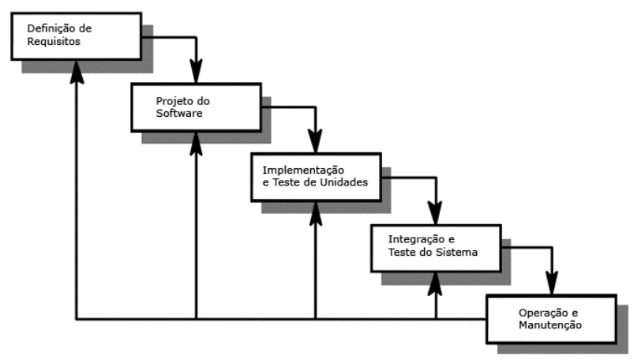
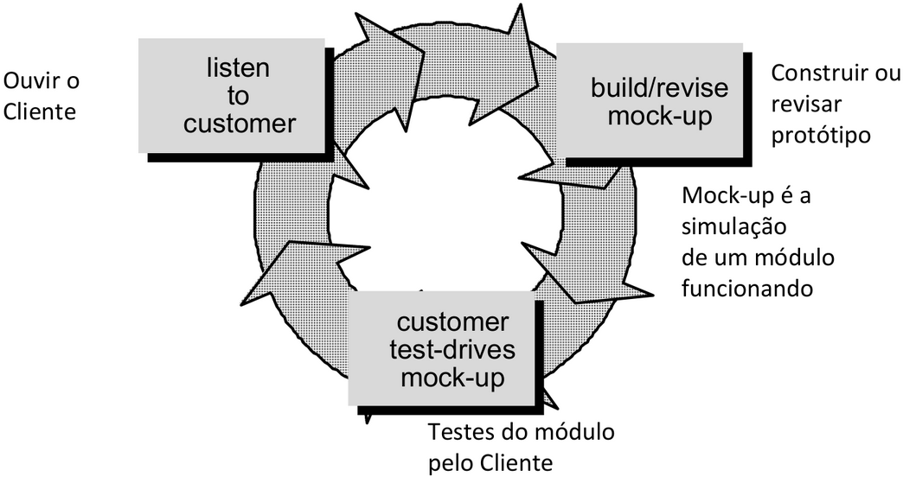
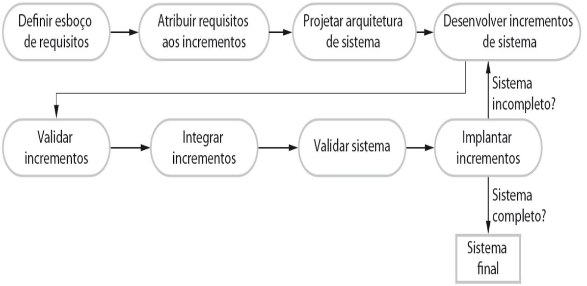
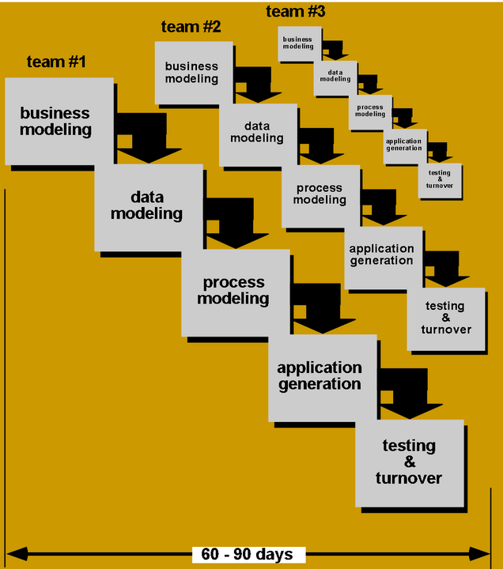
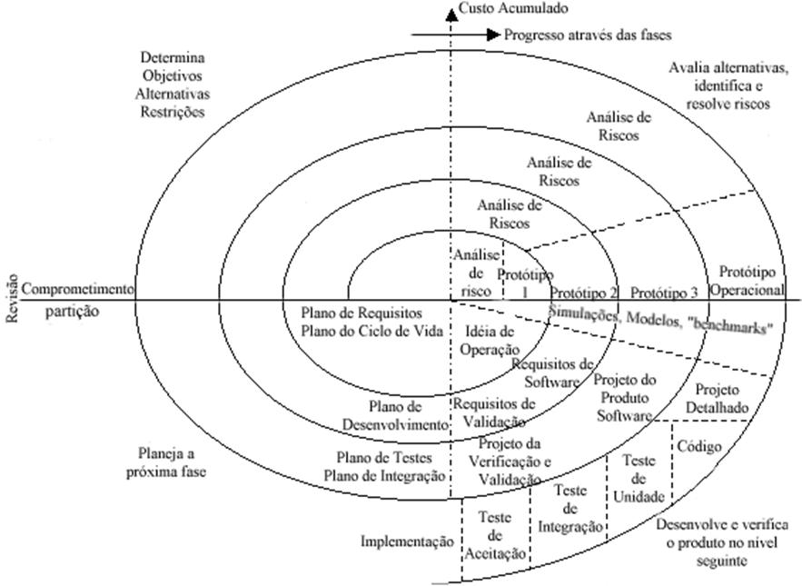
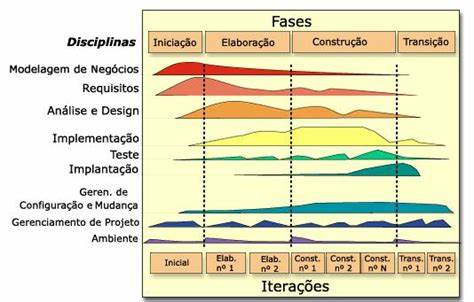
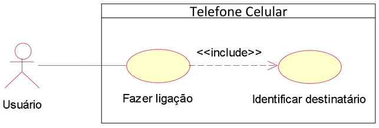
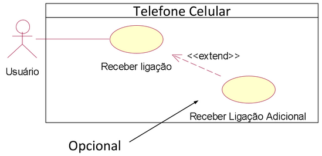

# Análise Orientada a Objetos I

Independente da abordagem utilizada ou metodologia usada, um projeto sempre passa pelas seguintes fases:

- Planejamento
- Análise
- Projeto
- Implementação

Além disso, todo projeto exige as seguintes ações:

- Levantamento de requisitos
- Modelagem das necessidades do negócio
- Criação de planos de desenvolvimento
- Entendimento das características do comportamento organizacional
- Gerenciamento de mudanças
- Formação de equipes

## Processos

O processo de Software é um conjunto estruturado de atividades necessárias para desenvolver um sistema de software.

Existem vários processos de desenvolvimento diferente, mas a maioria envolve:

- Especificação: definição do que o sistema deve fazer
- Projeto e Implementação: definição da organização do sistema e implementação do sistema
- Validação: checagem de que o sistema faz o que o cliente deseja
- Evolução: evolução em resposta a mudanças nas necessidades do cliente

### Descrições

A descrição de um processo de software acontece quando descrevemos as atividades de um processo, tais como: especificação de modelos de dados, desenvolvimento de interface de usuário, programação das regras de negócio, testes, organização das atividades, entre outros.

Podem incluir produtos (artefatos), que são os resultados de uma atividade ou processo.

Definição de papéis e cargos das pessoas envolvidas no processo.

Pré e Pós-Condições são marcos bem definidos de cada atividade e que devem ser verdadeiras antes e depois de uma atividade do processo ser executada, ou um produto ser produzido.

## Modelos Prescritivos de Processos

Existem vários tipos de modelos que tem como objetivo determinar o arcabouço dos processos com tarefas explícitas.

Cada modelo prescreve um fluxo de trabalho, a maneira como os elementos se inter-relacionam.

### Cascata

- Também chamado de ciclo de vida clássico ou linear
- Associado às metodologias da programação estruturada
- Inspirado na engenharia de processos industriais
- Adequado quando os requisitos são bem definidos, como em aperfeiçoamentos de um sistema existente
- Fases bem definidas e documentação constante e presente em todas as etapas do processo
- Baseia-se no BDUF (Big Design Up Front, "design completo antes de tudo") que consiste em propor um trabalho detalhado de análise e design antes de produzir as primeiras linhas de código
- Revisão ao final de cada fase para averiguar se é possível continuar ou não

### Prototipagem

- O cliente define um conjunto de objetivos gerais para o software
- Sem detalhamento dos requisitos de entrada, processamento e saída
- Indicado quando há necessidade de solução de software, mas não é possível detalhar os requisitos, onde o protótipo servirá justamente para esse detalhamento

### Evolucionário

- Repetir partes do processo à medida que os requisitos do sistema evoluem
- Cada ciclo desenvolve uma versão mais completa

#### Evolucionário Incremental

- Combina Cascata com Prototipagem
- Cada sequência produz um incremento que possam ser entregues ao cliente
- O primeiro incremento é chamado de núcleo do produto

#### Modelo RAD (Rapid Application Development)

- Incremental, com ciclo curto, entre 60 e 90 dias
- Adaptação do modelo sequencial linear, no qual a rapidez é obtida com componentes
- Equipes trabalham em paralelo em diferentes funções do sistema

Fases:

- Modelagem do negócio
- Modelagem dos dados
- Modelagem do processo
- Geração da aplicação
- Teste e entrega

#### Evolucionário Espiral

- O processo é representado como uma espiral, onde cada loop representa uma fase do processo
- As atividades são indicadas por um circuito em torno da espiral no sentido horário; esse processo é iniciado a partir do centro da espiral
- Cada ciclo produz algo a ser avaliado, não necessariamente código
- Não existem fases fixas como especificação ou projeto
  - Os loops na espiral são escolhidos de acordo com a necessidade
  - Os riscos são avaliados explicitamente e resolvidos no decorrer do processo
- Gerência de riscos, onde ao final de cada loop é verificado se é possível continuar
- Usa a prototipação como mecanismo de redução de riscos em qualquer etapa da evolução do projeto
- Ciclos
  - Ciclo mais interno: foco nas possibilidades do sistema
  - Próximo ciclo: foco nas definições dos requisitos do sistemas
  - Próximo ciclo: foco no projeto do sistema
  - Ciclo mais externo: foco na construção do sistema
- Setores
  - Definição de objetivos: são identificados os objetivos específicos para cadas fase
  - Avaliação e redução de riscos: os riscos são avaliados e atividades executadas para reduzir os principais riscos
  - Desenvolvimento e validação: um modelo de desenvolvimento para o sistema é escolhido, e pode ser qualquer um dos modelos genéricos
  - Planejamento: o projeto é revisto e a próxima fase da espiral é planejada

## Modelos de Processos de Desenvolvimento de Software

- Representação abstrata de um processo, com uma descrição do processo de uma perspectiva geral

### Modelo Rational Unified Process (RUP)

- Processo genérico moderno, derivado da UML
- Reúne aspectos de modelos prescritivos e ágil, sendo uma abordagem híbrida
- Apresenta como será a construção do sistema já na fase de implementação, mostrando o modelo do projeto e definindo o responsável em cada tarefa e como deverão ser executadas cada uma delas, por meio da descrição de metas
- Perspectivas
  - **Perspectiva dinâmica** que mostra fases do modelo ao longo do tempo
  - **Perspectiva estática** que mostra atividades realizado no processo
  - **Perspectiva prática** que sugere boas práticas a serem usadas durante o processo
- Fases
  - **Concepção ou Iniciação**: estabelece o business case para o sistema e levantar os requisitos
  - **Elaboração**: desenvolve um entendimento da extensão do problema e da arquitetura do sistema
  - **Construção**: projeta o sistema, programa e testa o sistema
  - **Transição**: implanta o sistema no seu ambiente de operação
- Interação
  - **Intra-fase**: cada fase é iterativa aos resultados desenvolvidos incrementalmente
  - **Inter-fase**: o conjunto todo de fases pode ser executado incrementalmente

Características básicas do RUP

- Processo orientado por casos de uso
  - Utiliza como unidade básica de planejamento os casos de uso (facilita a especificação de requisitos)
- Processo centrado na arquitetura
  - Modela o processo por meio de aspectos estáticos e dinâmicos do projeto
  - Depende de uma boa definição de arquitetura de sistema
    - Componentes bem definidos
    - Interfaces entre os componentes
- Interativo e Incremental
  - Projetos são divididos em projetos menores, que possuem iteração sobre todo o fluxo de trabalho

### Gerenciamento Ágil de Projetos (GAP)

Pilares dos métodos ágeis:

- Pessoas e interações acima de processos e ferramentas
- Software de trabalho funcionais acima de documentação abrangente
- Colaboração com o cliente acima da negociação de contratos
- Responder às mudanças mais do que seguir um plano

> Foco em valores humanos, sociais, ambientais e no resultado

Exemplos: XP, Scrum, FDD e ASD

#### Desenvolvimento incremental

- Construção do sistema de incremento em incremento
- Cada incremento é uma parte inteira

#### Desenvolvimento de Sistemas Dinâmicos

- Busca entregar 80% do projeto em 20% do tempo
- Fases: pré-projeto, ciclo de vida e pós-projeto
- Recomendada para projetos urgentes
- Possui cronograma e orçamento fechados, mas o roteiro aberto

#### Crystal Clear

- Valoriza a comunização com o cliente
- Evita a criação de ferramentas complexas que não serão utilizadas

#### Feature-drive development (FDD)

- Fragmenta o projeto em funcionalidades
- Cada tarefa tem como foco alguma funcionalidade
- Design que simplifica e promove a experiência do usuário
- Teste orientado à funcionalidade

#### Extremming Programming (XP)

- No início de cada semana cliente e desenvolvedores se reúnem para priorizar as funcionalidades que serão entregues até o final da semana
- Toda a equipe tem acesso ao código do projeto
- Teste de usuário
- Desenvolvimento orientado a testes
- Reuniões rápidas com a equipe em pé
- Programação em par
- Padronização de código
- Entregas curtas com integração contínua

#### Scrum

- Processo de Software Ágil, focado em desenvolver a comunicação da equipe.
- O time Scrum é composto por:
  - Product Owner (PO)
  - Scrum Master (SM)
  - Scrum Team (Equipe de Desenvolvimento)
- Projeto divido em etapas que são chamadas de Sprints
  - Cada sprint é um Time Box, com um conjunto de metas
- Daily Scrum são reuniões diárias feitas no início do expediente com o objetivo de revisar o dia anterior e determinar o que será feito no dia
- Product Backlog é um lista que agrupa todas as funcionalidades necessárias para um produto e é feita pelo PO
- Sprint Planning Meeting é uma reunião feita no início de cada Sprint para determinar as prioridades daquela Sprint
- Sprint Review Meeting é uma reunião feita para revisar o que foi atingido e o que não foi
- Release Burndown Chart é uma análise de metas atingidas no final de cada Sprint, o ideal é que tenha gráficos de análise de desempenho
- Recomendações
  - Equipes auto organizáveis e auto alocáveis
  - Equipes multifuncionais
  - Aproximação do cliente ou representante dele
  - Reunião diárias
  - Utilização de técnicas de estimativas (Planning Poker)
  - Utilização do Quadro Kanban

## Engenharia de Requisitos

> Engenharia de requisitos é o processo de descobrir, analisar, documentar e verificar as funções e restrições do sistema (Sommerville, 2003).

> Requisitos são as características que definem os critérios de aceitação de um produto.

Antes de elicitar os requisitos é necessário definir o escopo do sistema.

Abordar o problema da seguinte perspectiva:

- Qual o problema?
- Quem é afetado?
- Qual o impacto?
- Qual a solução?

### Atividades da Engenharia de Requisitos

- **Desenvolvimento de requisitos**: elicitação, análise, modelagem e validação
  - Cria e interpreta os requisitos
- **Gerência de requisitos**: identificação, configuração, priorização, rastreabilidade
  - Organiza e mantém os registros dos requisitos

> Elicitação de requisitos: momento onde são extraídas as informações do cliente sobre o que ele deseja que seja construído.

- Quanto mais tarde um erro é detectado, maior o custo de corrigi-ló
- Muitos erros são realizados durante a elicitação e definição de requisitos
- Erros típicos incluem fatos incorretos, omissões, inconsistência e ambiguidade

### Classificação dos Requisitos

- **Funcionais**: são os comportamentos que um programa ou sistema deve apresentar diante de certas ações de seus usuários. Ex: O sistema deve disponibilizar os resultados do exame do paciente.
- **Não-funcionais**: quantificam determinados aspectos do comportamento e adiciona algum tipo de restrição no sistema. Ex: As consultas ao sistema devem ser respondidas em três segundos.

Bons requisitos devem ser:

- Claros
- Não ambíguo
- Completo
- Simples
- Bem escrito

### Artefatos

Um produto de software pode gerar diversos artefatos:

- Código executáveis
- Códigos fontes
- Modelos
- Relatórios
- Outros documentos

### Histórias de Usuários

- Prática da XP
- Devem ser curtas
- É a definição textual das necessidades de uma pessoa, contextualizando em no máximo 3 linhas o problema a ser atacado.

Template:

- Eu como (ator)
- Quando (gatilho acionador da necessidade) - opcional
- Quero um/uma (necessidade)
- Para que (problema a ser resolvido)

Ex: **Eu como** agente de precificação **quero** consultar os preços do concorrente **para que** eu possa comparar os valores que pretendo praticar em minha loja sem ter de visitar a loja de cada um deles.

## Unified Modeling Language (UML)

- Linguagem para especificação, construção, visualização e documentação de sistemas criados com base na orientação a objetos
- Resultado da união dos métodos Booch, OMT e OOSE
- A versão atual da UML é a 2.5, lançada em 2015

As notações UML são distribuídas em duas categorias de diagramas, a estrutural e comportamental.

### Objetos e Classes

Os **objetos** representam entidades discretas, com fronteiras bem-definidas e identidade própria, que possuem **estado** e **comportamento**.

Objetos similares são agrupados em **classes**, que são descritores de um **conjunto de objetos** que partilham os mesmos atributos, operações, relacionamentos e comportamento.

A classe na UML é representada por três compartimentos em um retângulo: o nome da classe, os atributos e as operações.

Atributos ou operações estáticos aplicam-se à classe como um todo e não a instâncias (objetos individuais) e são identificados com um sublinhado.

### Associação

- Define um relacionamento entre duas classes, permitindo que um objeto tenha acesso a estrutura de um outro objeto.
- Associação simples A -> B
- Associação bidirecional A <-> B
- Agregação A <>--> B (A classe principal pode existir sem a classe agregadora) - Símbolo vazio
- Composição A <>--> B (A dependência entre classes é muito forte) - Símbolo preenchido

Relacionamento todo-parte: agregação e composição

### Multiplicidade

- Nem sempre o relacionamento entre classes será de um para um.
- `1.` : representa uma associação contendo um elemento
- `*.` : representa uma associação contendo uma lista de elementos
- `0..1` : representa uma associação contendo zero ou um elemento
- `0..*` : representa uma associação contendo zero ou uma lista de elementos
- `1..*` : representa uma associação contendo um ou uma lista de elementos

### Visibilidade

- Os atributos e métodos de uma classe podem receber níveis de visibilidade, e na UML existem símbolos que representam cada um deles.
- (+) visibilidade pública
  - Acessível dentro e fora da classe, e por suas subclasses
- (#) visibilidade protegida (herança)
  - Acessível apenas dentro da própria classe, e por suas subclasses
- (-) visibilidade privada
  - Acessível apenas dentro da própria classe

### Generalização/Especialização

- Superclasse: classe principal que agrega as atributos e operações
- Subclasse: classe que herda atributos e operações da sua superclasse e pode implementar novos atributos e operações
- Classe abstrata: classe que não é instanciada, apenas fornece um modelo para geração de outras classes
- Classe concreta: classe que pode ser instanciada diretamente
- Classe singleton: classe que só pode ser instanciada uma única vez
- Classe de interface: classe que define um conjunto de métodos que a classe concreta deve implementar (herança múltipla)
- Classe static: classe que não pode ser instanciada como objeto e contém apenas métodos ou atributos estáticos
- Classe de utilitário (helper): classe que contém métodos utilitários que realizam tarefas comuns. Normalmente os métodos são estáticos e não precisam ser instanciadas
- Classe final: classe que não pode ser estendida por outras classes
- Classe signal: classe que representa eventos ou mensagens que desencadeiam algum comportamento
- Classe de interface de usuário: classe que representa componentes ou módulos relacionados à interação com o usuário em um sistema
- Classe de container ou coleção: classe para armazenar e gerenciar um grupo de objetos

## Casos de Uso

- Escritos na linguagem do problema
- Ajudam a unificar critérios
- Estimulam o pensamento
- Ajudam no treinamento e rastreamento
- Mostra o que o sistema faz, não como
- Encapsula um coleção de cenários, tanto de sucesso quanto de falha

> Um caso de uso é uma forma específica de uso do sistema, composto por uma sequência de ações que produz um resultado de valor para algum agente externo.

### Modelagem de Casos de Uso

- Ator: elemento externo do sistema que sempre inicia o uso ou recebe um valor do caso de uso
  - Uma mesma pessoa pode ter diferentes papéis em um sistema e cada papel deve ser representado individualmente
- Caso de Uso: serviço que o sistema fornece aos usuários
- Interação: estímulos recebidos pelo sistema
- Sistema: contexto aonde o caso de uso é utilizado

Tipos de interação

- Inclusão: quando um caso precisa de outro
  - `<<include>>`
    
- Extensão: quando um caso de uso pode opcionalmente utilizar um outro
  - `<<extend>>`
    

A especificação de um caso de uso inclui:

- Identificador: única e não deve mudar
- Nome e breve descrição: ideia do propósito do caso de uso
- Ator(es)
- Prioridade: pode ser classificado em essencial, importante e desejável
- Requisitos não funcionais associados
- Pré-condições: estado em que o software estar para realizar o caso de uso
- Pós-condições: estado em que o software pode estar após o término do caso de uso
- Fluxo de eventos principal: funcionalidade principal
- Fluxos secundários: alternativos e de exceção
