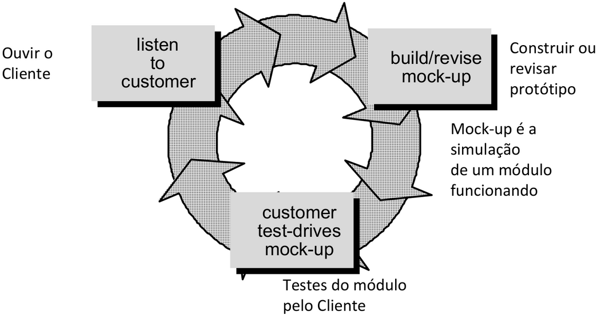

# Análise Orientada a Objetos I

Independente da abordagem utilizada ou metodologia usada, um projeto sempre passa pelas seguintes fases:

- Planejamento
- Análise
- Projeto
- Implementação

Além disso, todo projeto exige as seguintes ações:

- Levantamento de requisitos
- Modelagem das necessidades do negócio
- Criação de planos de desenvolvimento
- Entendimento das características do comportamento organizacional
- Gerenciamento de mudanças
- Formação de equipes

## Processos

O processo de Software é um conjunto estruturado de atividades necessárias para desenvolver um sistema de software.

Existem vários processos de desenvolvimento diferente, mas a maioria envolve:

- Especificação: definição do que o sistema deve fazer
- Projeto e Implementação: definição da organização do sistema e implementação do sistema
- Validação: checagem de qe o sistema faz o que o cliente deseja
- Evolução: evolução em resposta a mudanças nas necessidades do cliente

### Descrições

A descrição de um processo de software acontece quando descrevemos as atividades de um processo, tais como: especificação de modelos de dados, desenvolvimento de interface de usuário, programação das regras de negócio, testes, organização das atividades, entre outros.

Podem incluir produtos (artefatos), que são os resultados de uma atividade ou processo.

Definição de papéis e cargos das pessoas envolvidas no processo.

Pré e Pós-Condições são marcos bem definidos de cada atividade e que devem ser verdadeiras antes e depois de uma atividade do processo ser executada, ou um produto ser produzido.

## Modelos Prescritivos de Processos

Existem vários tipos de modelos que tem como objetivo determinar o arcabouço dos processos com tarefas explícitas.

Cada modelo prescreve um fluxo de trabalho, a maneira como os elementos se inter-relacionam.

### Cascata

- Também chamado de ciclo de vida clássico ou linear
- Associado às metodologias da programação estruturada
- Inspirado na engenharia de processos industriais
- Adequado quando os requisitos são bem definidos, como em aperfeiçoamentos de um sistema existente

### Prototipagem

- O cliente define um conjunto de objetivos gerais para o software
- Sem detalhamento dos requisitos de entrada, processamento e saída
- Indicado quando há necessidade de solução de software, mas não é possível detalhar os requisitos, onde o protótipo servirá justamente para esse detalhamento

### Evolucionário Incremental

- Combina Cascata com Prototipagem
- O primeiro incremento é chamado de núcleo do produto
- Repete parte do processo à medida que os requisitos do sistema evoluem
- Cada ciclo desenvolve uma versão mais completa

### Modelo RAD (Rapid Application Development)

- Incremental, com ciclo curto
- Adaptação do modelo sequencial linear, no qual a rapidez é obtida com componentes
- Equipes trabalham em paralelo em diferentes funções do sistema

Fases:

- Modelagem do negócio
- Modelagem dos dados
- Modelagem do processo
- Geração da aplicação
- Teste e entrega

### Evolucionário Espiral

- O processo é representado como uma espiral, onde cada loop representa uma fase do processo
- Cada ciclo produz algo a ser avaliado, não necessariamente código
- Gerência de riscos, onde ao final de cada loop é verificado se é possível continuar
