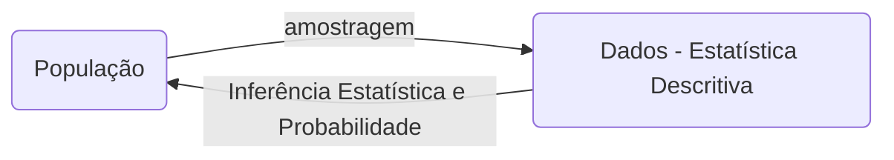
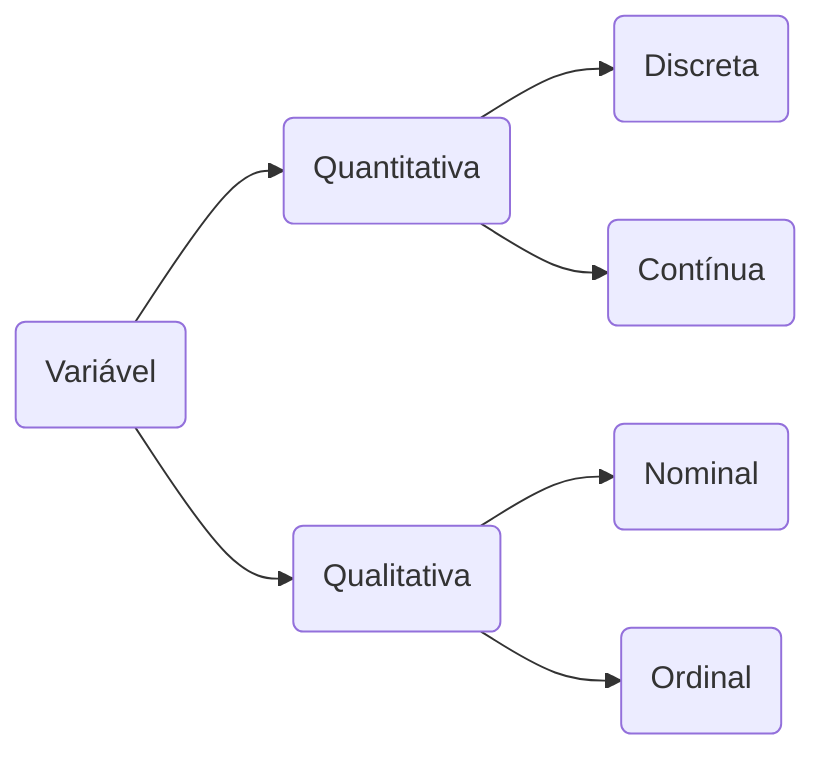

# Estatística Aplicada à Informática

A estatística aplicada à informática permite que os profissionais tomem decisões informadas, otimizem processos e melhorem a qualidade dos produtos de software.

> Estatística é o conjunto de técnicas que permite, de forma sistemática, coletar, organizar, descrever, analisar e interpretar dados de estudos e experimentos em qualquer área de conhecimento (Magalhães, 2002).

## Áreas da estatística

- Estatística descritiva: contato inicial com os dados, tem o objetivo de descrever e resumir os dados para identificar as característica de interesse.
- Inferência estatística: ramo da estatística que tem o objeto de fazer afirmações a partir de um subconjunto de dados e fundamenta-se na teoria das probabilidades.

> Probabilidade: teoria matemática utilizada para se estudar a incerteza oriunda de fenômenos de caráter aleatório.

## Conceitos básicos

- População: conjunto de elementos com pelo menos uma características em comum.
- Censo: conjunto de dados estatísticos dos habitantes de uma localidade com todas as suas características em um determinado período de tempo.
- Parâmetro: medida numérica que descreve uma característica de uma população.
- Amostra: subconjunto de uma população.
- Variáveis: característica que podem variar entre as unidades da população.

## Tipos de amostragem

- Amostra casual simples: todos os elementos da população devem ter chance igual de escolha, baseada em um sorteio aleatório.
- Amostra estratificada: os elementos dessa amostra são compostos por todos os estratos da população e em cada estrato é feito um sorteio aleatório.
- Amostra sistemática: os elementos são escolhidos não por acaso, mas por um sistema, no entanto, inicia-se com um sorteio aleatório.
- Amostra por conglomerado: os elementos são selecionados em vários estágios de sorteio indo do maior conjunto para o menor.

## Tipos de variáveis

- Variáveis qualitativas ou categóricas: os elementos possuem atributos ou qualidades. Ex: cor, sexo, escolaridade, doença, condição do ar, etc.
  - Ordinais: quando possui uma ordenação. Ex: grau de escolaridade, condição do ar, etc.
  - Nominais: quando não possui ordenação. Ex: sexo, cor, etc.
- Variáveis quantitativas ou de medidas: quando seus valores são expressos em números: Ex: altura, peso, número de filhos, etc.
  - Discretas: são contáveis e em valores inteiros. Ex: número de filhos, número de pessoas doentes, etc.
  - Contínuas: são contáveis resultantes de uma mensuração, logo assumem valores dentro dos números reais. Ex: peso, altura, concentração de reagentes, etc.

## Coleta de dados

Os dados podem ser de dois tipos:

- Dados primários: quando são publicados pela própria pessoa ou organização que fez a coleta
- Dados secundários: quando são publicados por outra organização que não fez a coleta

A classificação quanto ao tempo pode ser:

- Contínua: quando realizada permanentemente. Ex: inflação, registro de nascimento e óbitos
- Periódica: quando realizada em intervalos de tempo. Ex: inflação mensal, censo.
- Ocasional: quando realizada sem época estabelecida. Ex: pesquisa de mercado.

## Série estatística

Uma tabela que apresenta os dados estatísticos em função da época, local ou da espécie e são usadas para variáveis qualitativas nominais.

- Geográfica: espacial, localização, território
- Específica: categórica, por espécie, classe
- Temporal: história, por data, cronológica
- Conjugada: mais de um tipo.

## Tipos de gráficos

Os gráficos são usados para apresentar os dados de forma mais chamativa.

- Gráfico de setor: mostra relação dos itens pesquisados em relação ao todo. Usado para representa variáveis qualitativas com poucas características e usa muito porcentagem.
- Gráfico de colunas ou barras: apresenta os dados por categorias.Usado para representar variáveis qualitativas e quantitativas discretas.
- Gráfico de linha: mostra evolução dos elementos em um determinado período de tempo.
