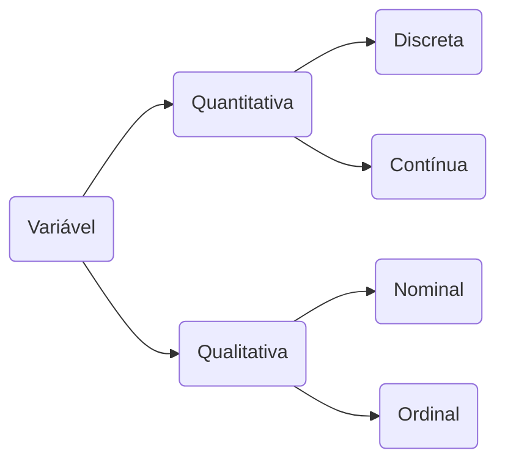

# Estatística Aplicada à Informática

A estatística aplicada à informática permite que os profissionais tomem decisões informadas, otimizem processos e melhorem a qualidade dos produtos de software.

> Estatística é o conjunto de técnicas que permite, de forma sistemática, coletar, organizar, descrever, analisar e interpretar dados de estudos e experimentos em qualquer área de conhecimento (Magalhães, 2002).

## Áreas da estatística

- Estatística descritiva: contato inicial com os dados, tem o objetivo de descrever e resumir os dados para identificar as característica de interesse.
- Inferência estatística: ramo da estatística que tem o objeto de fazer afirmações a partir de um subconjunto de dados e fundamenta-se na teoria das probabilidades.

> Probabilidade: teoria matemática utilizada para se estudar a incerteza oriunda de fenômenos de caráter aleatório.

## Conceitos básicos

- População: conjunto de elementos com pelo menos uma características em comum.
- Censo: conjunto de dados estatísticos dos habitantes de uma localidade com todas as suas características em um determinado período de tempo.
- Parâmetro: medida numérica que descreve uma característica de uma população.
- Amostra: subconjunto de uma população.
- Variáveis: característica que podem variar entre as unidades da população.

## Tipos de amostragem

- Amostra casual simples: todos os elementos da população devem ter chance igual de escolha, baseada em um sorteio aleatório.
- Amostra estratificada: os elementos dessa amostra são compostos por todos os estratos da população e em cada estrato é feito um sorteio aleatório.
- Amostra sistemática: os elementos são escolhidos não por acaso, mas por um sistema, no entanto, inicia-se com um sorteio aleatório.
- Amostra por conglomerado: os elementos são selecionados em vários estágios de sorteio indo do maior conjunto para o menor.

## Tipos de variáveis

- Variáveis qualitativas ou categóricas: os elementos possuem atributos ou qualidades. Ex: cor, sexo, escolaridade, doença, condição do ar, etc.
  - Ordinais: quando possui uma ordenação. Ex: grau de escolaridade, condição do ar, etc.
  - Nominais: quando não possui ordenação. Ex: sexo, cor, etc.
- Variáveis quantitativas ou de medidas: quando seus valores são expressos em números: Ex: altura, peso, número de filhos, etc.
  - Discretas: são contáveis e em valores inteiros. Ex: número de filhos, número de pessoas doentes, etc.
  - Contínuas: são contáveis resultantes de uma mensuração e assumem valores dentro dos números reais. Ex: peso, altura, concentração de reagentes, etc.

## Fases do método estatístico

- Definição do problema
- Planejamento
- Coleta de dados
- Crítica dos dados
- Apresentação dos dados
- Análise e interpretação dos dados

### Definição do problema

Consiste em uma definição ou formulação correta do problema a ser estudado.

### Coleta de dados

Os dados podem ser de dois tipos:

- Dados primários: quando são publicados pela própria pessoa ou organização que fez a coleta
- Dados secundários: quando são publicados por outra organização que não fez a coleta

A classificação quanto ao tempo pode ser:

- Contínua: quando realizada permanentemente. Ex: inflação, registro de nascimento e óbitos
- Periódica: quando realizada em intervalos de tempo. Ex: inflação mensal, censo.
- Ocasional: quando realizada sem época estabelecida. Ex: pesquisa de mercado.

### Crítica dos dados

O objetivo a eliminação de erros capazes de provocar futuros enganos, suprimindo os valores estranhos.

### Apresentação dos dados

Organização dos dados por meio de tabelas e gráficos.

#### Série estatística

Uma tabela que apresenta os dados estatísticos em função da época, local ou da espécie e são usadas para variáveis qualitativas nominais.

- Geográfica: espacial, localização, território
- Específica: categórica, por espécie, classe
- Temporal: história, por data, cronológica
- Conjugada: mais de um tipo.

#### Tipos de gráficos

Os gráficos são usados para apresentar os dados de forma mais chamativa. Os requisitos principais de uma representação gráfica são a simplicidade, clareza e veracidade.

- Diagramas: gráficos geométricos; no máximo duas dimensões; usa o sistema cartesiano
- Cartogramas: representação de uma carta geográfica
- Pictogramas: representação gráfica através de figuras

- Gráfico de setor: mostra relação dos itens pesquisados em relação ao todo. Usado para representa variáveis qualitativas com poucas características e usa muito porcentagem.
- Gráfico de colunas ou barras: apresenta os dados por categorias.Usado para representar variáveis qualitativas e quantitativas discretas.
- Gráfico de linha: mostra evolução dos elementos em um determinado período de tempo. Faz-se uso de duas retas perpendiculares; as retas são os eixos coordenados e o ponto de intersecção, a origem. O eixo horizontal é denominado eixo das abscisas (x) e o vertical, eixo das ordenadas (y).

### Análise e interpretação dos dados

Consiste em tirar conclusões a partir dos dados apresentados.

## Representação Tabular

É uma apresentação numérica dos dados que consiste em dispor os dados em linhas e colunas de maneira ordenada.

Uma tabela compõe-se de título, cabeçalho, corpo, rodapé e colunas (indicadoras e numéricas).

- Recomenda-se não fechar por traços verticais as extremidades à direta e à esquerda
- Usa-se um traço (-) quando o valor for nulo
- Usa-se reticências (...) quando não se dispuser dos dados, mas eles podem ser quantificados
- Usa-se zero (0) quando o valor é muito pequeno para ser expresso pela unidade utilizada
- Usa-se interrogação (?) quando o valor é duvidoso

## Distribuição de frequências

Quando há um grande volume de dados é quase impossível examiná-los, por isso há a necessidade de organizá-los em tabelas de distribuições de frequência.

### Distribuição de frequências por intervalos

É uma série estatística na qual a variável observada está dividida em subintervalos do intervalo total observado e o tempo, espécie e região permanecem fixas.

#### Intervalo de classe

Apresenta limite inferior (LI) e superior (LS).

Convenções:

|---- Intervalo fechado à esquerda e aberto à direita, apenas o limite inferior pertence ao intervalo;

----| Intervalo aberto à esquerda e fechado à direita, apenas o limite superior pertence ao intervalo;

|----| Intervalo fechado de ambos os lados, os dois limites pertencem ao intervalo;

\---- Intervalo aberto em ambos os lados, os dois limites não pertencem ao intervalo;

Ex: O intervalo de classe 5 ---| 10 indica que o limite inferior é 5 e o superior é 10.

A **amplitude total da distribuição de frequência (AT)** é a diferença entre o maior e o menor valor observado.

As **classes de uma distribuição de frequência (K)** são os subintervalos da variável.

Formas de calcular a K:

- Fórmula de Sturges:
  - K = 1 + 3,322 log.N
- Fórmula do excel:
  - Se n < 25 utilize k = 5; se n >= 25 utilize k = raiz quadrada de n.

**Frequência simples ou frequência absoluta da classe (fi)** é o número de observações contadas dentro da classe.

**Frequência absoluta acumulada de classe (Fi)** é a acumulação sucessiva, a partir da primeira classe até uma classe qualquer, da frequência simples ou absoluta da classe.

**Frequência relativa de classe (fr)** é a relação existente entre a frequência absoluta ou simples da classe e o número de observações da variável. É calculada pela divisão do frequência simples pela absoluta acumulada.

**Frequência relativa acumulada (Fr)** é a acumulação sucessiva, a partir da primeira classe até uma classe qualquer das frequências relativas das classes.

**Ponto médio da classe (xi)** é a média entre os limites superior e inferior.

**Intervalo de classe ou amplitude do intervalo de classe (h)** é o comprimento da classe. Obtido através da divisão da AT pelo K.

## Medidas de tendência central

- Média aritmética simples
- Média aritmética ponderada
- Média geométrica
- Média harmônica
- Mediana
- Moda
- Medidas separatrizes
  - Quartis
  - Decis
  - Percentis

## Medidas de dispersão

- Amplitude
- Desvio médio
- Variância
- Desvio Padrão
- Coeficiente de variação
- Assimetria
- Coeficientes de assimetria
- Curtose

