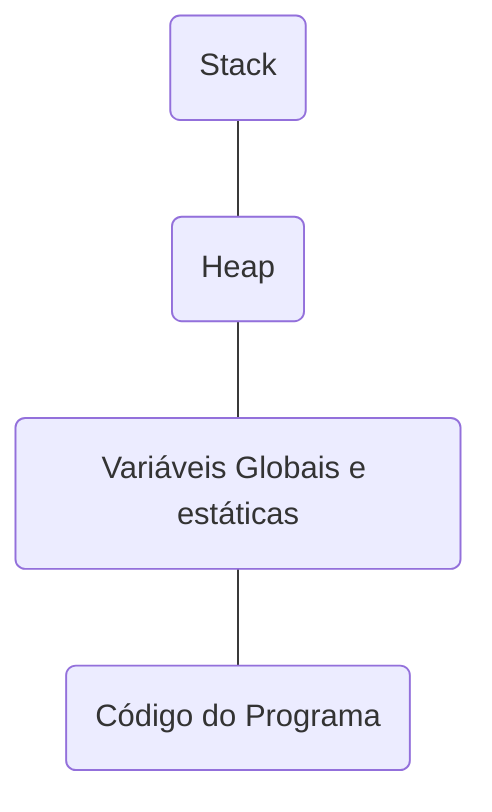
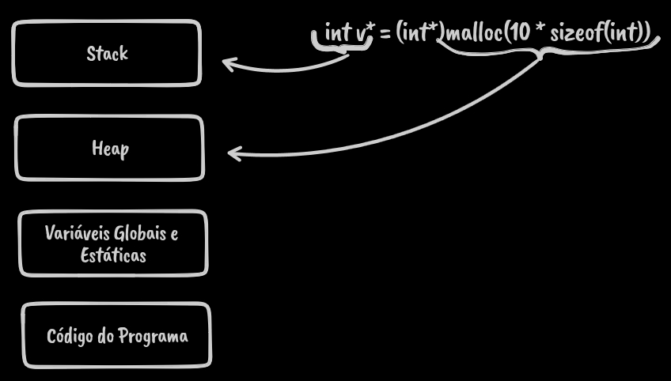

# Estrutura de Dados, Pesquisa e Ordenação

A estrutura de dados trata-se do estudo e da implementação de diferentes formas de organizar, armazenar, manipular e buscar dados em computadores.

Não depende de linguagem de programação específica, mas sim da estrutura que o programador quer aplicar no seu programa.

## Fila

Estrutura de dados que segue o princípio FIFO (First-In, First-Out), onde o primeiro elemento inserido é o primeiro a ser removido.

Ex: Sistema de fila de espera

## Pilha

Estrutura de dados que segue o princípio LIFO (Last-In, First-Out), onde o primeiro elemento inserido é o último a sair.

Ex: Operações aritméticas

## Árvore

Estrutura de dados hierárquica composta por nós, onde cada nós possui um valor zero ou mais nós filhos, que estão conectados por arestas. O nós raiz é de onde todos os outros nós são acessíveis.

Ex: Sistema de diretórios em um SO

## Grafo

Estrutura de dados que consiste em um conjunto de vértices (ou nós) e um conjunto de arestas que conectam esses vértices. Os grafos podem ser direcionados ou não direcionados.

Ex: Algoritmos de busca e otimização

## Linguagem C

Linguagem de Programação de propósito geral desenvolvida por Dennis Ritchie em 1972 na Bell Labs.

É uma linguagem de baixo nível que permite um controle maior sobre o hardware do computador.

Principais características:

- Simplicidade
- Portabilidade
- Eficiência
- Recursos de baixo nível
- Ampla utilização
- Base para outras linguagens
- Possui biblioteca padrão

### Estrutura básica de um programa em C

```
Diretivas para pré-processadores
Declaração de constantes

tipo funcao1(){}

tipo main(){}
```

### Diretivas

As **diretivas** são instruções, geralmente, definidas nas primeiras linhas do código fonte que tem o objetivo de modificar o texto fonte antes mesmo da sua compilação. Elas não são compiladas, sendo direcionadas ao pré-processador, que é executado pelo compilador antes da compilação propriamente dita.

A diretiva `#include` permite incluir uma biblioteca.

Exemplos:

| Diretiva            | Função                     |
| ------------------- | -------------------------- |
| #include <stdio.h>  | Funções de entrada e saída |
| #include <stdlib.h> | Funções padrão             |
| #include <math.h>   | Funções matemáticas        |
| #include <string.h> | Funções de texto           |
| #include <locale.h> | Funções de acentuação      |

A biblioteca `<stdio.h>` é uma das principais a serem incluídas no código fonte.

Ela da acesso as funções `scanf()` (input) que lê dados e armazena em variáveis especificadas e `printf()` (output) que escreve dados formatados.

A biblioteca `<locale.h>` permite acentuar letras e deve ser setada na função `main`.

```c
#include <locale.h>

int main(){
  setlocale(LC_ALL, "Portuguese");
}
```

A biblioteca `<stdlib.h>` contém funções responsáveis pela manipulação da alocação e desalocação de memória.

```c
#include <stdlib.h>

int main(){
  printf("Olá, mundo");
  system("PAUSE"); // Espera o usuário pressionar alguma tecla para continua a execução
}
```

### Variáveis e Constantes

No topo dos arquivos do programa é possível definir constantes usando a palavras reservada `#define` seguida do nome da variável e do seu valor.

```c
#include <stdio.h>
#define PI 3.1415 // Constante
```

> Se não inicializarmos as variáveis, elas podem ter lixos de memória de outras inicializações.

Por ser uma linguagem fortemente tipada, é necessário definir os tipos das variáveis.

```c
int qtde; // Recebe valores inteiros
float n1; // Recebe valores com ponto flutuante
char nome[10]; // Recebe uma lista de caracteres
```

> O tipo `char` é definido sempre usando aspas simples.
>
> É necessário sempre definir um `char` com mais espaço do que o necessário, pois o último valor armazenado é o terminador de string `\0`.

Os modificadores de tipo do C são: signed, unsigned, long e short.

### Endereçamento de memória

A memória RAM de um computador é uma sequência de bytes, a posição que é ocupada por um byte é o seu endereço.

Cada variável de um programa ocupa um certo número de bytes consecutivos na memória do computador.

A atribuição de endereços depende do SO, pode ser crescente ou decrescente.

| Tipo   | Bytes   |
| ------ | ------- |
| char   | 1 byte  |
| int    | 4 bytes |
| float  | 4 bytes |
| double | 8 bytes |
| bool   | 1 byte  |
| long   | 8 bytes |

Em vetores é possível fazer um ponteiro apontar para o início de um vetor usando a seguinte sintaxe:

```c
p = v; // ponteiro p aponta para o início do vetor v
```

O comando acima equivale a:

```c
p = &v[0];
```

O nome do vetor aponta para o endereço do primeiro elemento do vetor.

Para acessar o endereço de memória de uma variável é possível usar o formatador `%p` para imprimir o endereço:

```c
int numero = 10;
printf("Endereço de memória da variável número é: %p\n", &numero);
```

Também é possível salvar o endereço de memória dentro de um ponteiro:

```c
int numero = 10;
int *endereco = &numero;
printf("Endereço de memória da variável número é: %p\n", endereco);
```

### Alocação dinâmica de memória

A alocação dinâmica permite alocar e desalocar memória para novos arrays quando o programa está sendo executado e não apenas quando se está escrevendo o programa.

A alocação dinâmica só pode ser feita através de ponteiros.

O gerenciamento cuidadoso de alocação e liberação deve ser feito para evitar vazamento de memória ou corrupção de dados.

A memória RAM é dividida em várias áreas:



A **Stack** é uma região usada para armazenar informações temporárias relacionadas a execução de funções, endereços de retorno, parâmetros de funções e variáveis locais.

A **Heap** é a região mais dinâmica e flexível da memória, usada para alocar dados dinamicamente durante a execução do programa, como objetos, arrays e estruturas de dados.

A região das **variáveis globais e estáticas** são inicializadas antes da execução do programa e mantêm seu valor durante toda a execução.

O **código do programa** ou código executável é a região que contém instruções de máquina que compõem o programa em execução, geralmente é uma área apenas de leitura, visto que o código do programa não deve ser alterado durante a execução.

O processo de alocação dinâmica acontece na memória Heap.

#### Funções de gerenciamento de memória

As funções de gerenciamento de memória fazem parte da biblioteca `stdlib`. Adicionar sua diretiva no início do programa para usa-lá.

`malloc()`

Função usada para alocar espaço em um bloco de bytes consecutivos, sua sintaxe é:

```c
int *v; // define o ponteiro
v = (int*) malloc(quantidadePosicoes * numeroBytes);
```

> (int\*) é opcional
>
> Os bytes alocados são inicializados sem conteúdo, podendo conter lixo.

Como a alocação dinâmica só funciona através de ponteiros é necessário primeiro definir um.

A função `malloc` recebe a quantidade de posições multiplicado pela quantidade de bytes de acordo com o tipo do ponteiro, por exemplo, se é um `int`, será 4 bytes, se fosse um `char` seria 1 byte.

```c
int *v;
v = malloc(10 * 4);
```

Para definir dinamicamente o número de bytes de um tipo de dados é possível usar a função `sizeof()`.

```c
int *v;
v = malloc(10 * sizeof(int)); // aloca espaço para 10 inteiros
```

`calloc`

Similar a `malloc()`, mas inicializa todos os bytes alocados com zero, o que pode ser útil quando a memória deve ser inicializada.

```c
int *v; // define o ponteiro
v = (int*) calloc(quantidadePosicoes, numeroBytes);
```

Diferente da `malloc` os valores são separados por vírgula e não multiplicados.

```c
int *v; // define o ponteiro
v = (int*) calloc(10, sizeof(int));
```

`free`

Sempre que um programa termina a memória é liberada, mas se for um programa grande é possível fazer a liberação da memória Heap de forma manual através da função `free()`, passando como parâmetro o ponteiro da memória a ser liberada. Além disso, é uma boa prática atribuir NULL ao ponteiro liberado.

```c
int *v; // define o ponteiro
v = (int*) calloc(10, sizeof(int));
free(v);
v = NULL;
```

`realloc`

Está função é usada para mudar o tamanho de um bloco de memória previamente alocado.

Sua sintaxe é:

```c
int *v; // define o ponteiro
v = (int*) realloc(vetor, quantidadePosicoes * numeroBytes);
```

Como parâmetros da função são passados o ponteiro que eu quero alterar e a quantidade de posições e número de bytes.

```c
int *v; // define o ponteiro
v = (int*) realloc(v, 10 * sizeof(int));
```

Esquema da Alocação Dinâmica da Memória



### Void

- Palavra reservada que pode ser usada para:
  - Indicar que uma função não retorna nenhum valor.
  - Indicar que uma função não recebe nenhum parâmetro.
  - Permitir a criação de ponteiros genéricos.
  - Criar funções sem argumentos e sem retorno.

```c
#include <stdio.h>

void mostrar_texto(void){
  printf("Olá, mundo\n");
  return;
}

int main(void){
  mostrar_texto();
  return 0;
}
```

### Operações de entrada e saída

Usa-se o `printf()` para saída de dados. Dentro dessa função é possível usar máscaras e escapes para formatar a saída.

Cada tipo de variável possui um código de máscara específico.

| Tipo    | Máscara        |
| ------- | -------------- |
| char    | %c             |
| int     | %d ou %i ou %u |
| float   | %f ou %F       |
| double  | %lf            |
| long    | %li            |
| string  | %s             |
| pointer | %p             |

> É possível definir a quantidade de casas decimais usando a máscara. Por exemplo, `%.2f`, define que o número do tipo float terá duas casas decimais.

O escape é representado pelo símbolo \ (barra invertida) seguindo de um caractere.

| Código | Significado          |
| ------ | -------------------- |
| `\a`   | tocar um bip         |
| `\b`   | backspace            |
| `\n`   | quebra de linha      |
| `\r`   | return               |
| `\t`   | tabulação horizontal |
| `\'`   | apóstrofe            |
| `\"`   | aspas                |
| `\\`   | barra invertida      |
| `%%`   | percent              |

No exemplo abaixo, `%c` é a máscara para a variável do tipo `char` e `\n` é o escape que faz uma quebra de linha.

```c
#include <stdio.h>

int main(){
  char nome[6] = 'Maria';
  printf("Olá, %c\n", nome);
}
```

Usa-se o `scanf()` para entrada de dados. Nessa função é definido o formato do dado, através da máscara de formatação, e a variável na qual esse dado será armazenado precedida pelo caractere `&`.

> `&` Operador unário que significa "endereço de..."
>
> Para o tipo string (`%s`) não é necessário usar o operador `&`, pois a string em si já é um endereço de memória.

```c
#include <stdio.h>

int main(){
  int i;
  float r;
  char str[10];

  printf("Valor inteiro: ");
  scanf("%d", &i);
  printf("Valor real: ");
  scanf("%f", &r);
  printf("Valor string: ");
  scanf("%s", &str);
}
```

A função `scanf()` ignora tudo após encontrar um espaço em branco, logo, textos que contém espaços são cortados.

Para corrigir isso, usa-se a função `gets()`, em que se passa como parâmetro a variável no qual se deseja armazenar o dado.

```c
#include <stdio.h>
#include <string.h>
#define N 50

int main(){
  char s[N];
  int i;

  printf("Digite um texto\n");
  gets(s);

  i = strlen(s);
  printf("Tamanho do texto: %d\n", i);

  printf("Impressão de posição a posição: \n");
  for(i = 0; i < strlen(s); i++){
    printf("%c", s[i]);
  }
}
```

### Vetores do tipo String

Usa-se a função `fgets()` para ler entradas de dados do tipo String. A leitura é interrompida ao se encontrar a flag `\0` e não no espaço em branco como no `scanf()`.

```c
#include <stdio.h>

int main(){
  char nome[8];

  fgets(nome, 8, stdin); // lê 7 caracteres
  printf("%s \n", nome);

  return 0;
}
```

O tipo String nao pode ser comparado com outro usando os operadores relacionais, é necessário comparar posição por posição da String, por ser um vetor de caracteres, é possível usar um laço de repetição para isso.

Para manipular strings usa-se a diretiva `string.h`, abaixo estão algumas das suas funções.

| Função                         | Ação                                     |
| ------------------------------ | ---------------------------------------- |
| `strcpy(str1_dest, str2_orig)` | Copia string da origem para o destino    |
| `strcat(str1, str2)`           | Concatena as strings                     |
| `strcmp(str1, str2)`           | Compara strings. Retorna 0 (=) ou 1 (!=) |
| `strlen(str1)`                 | Calcula o tamanho da string              |
| `strupr(str1)`                 | Converte a string para maiúscula         |
| `strlwr(str1)`                 | Converte a string para minúscula         |

> strupr e strlwr não funcionam no Linux

### Operadores

#### Aritméticos

| Operador | Função                  |
| -------- | ----------------------- |
| `+`      | Soma                    |
| `-`      | Subtração               |
| `*`      | Multiplicação           |
| `/`      | Divisão                 |
| `%`      | Módulo/ Divisão inteira |
| `**`     | Exponenciação           |
| `++`     | Incremento              |
| `--`     | Decremento              |

#### Relacionais

| Operador | Função           |
| -------- | ---------------- |
| `>`      | Maior que        |
| `<`      | Menor que        |
| `>=`     | Maior ou igual à |
| `<=`     | Menor ou igual à |
| `==`     | Igual à          |
| `!=`     | Diferentes       |

#### Lógicos

| Operador | Função              |
| -------- | ------------------- |
| `!`      | (Not) Não - Negação |
| `&&`     | (And) E - Conjunção |
| `\|\|`   | (Or) Ou - Disjunção |

#### Auto-atribuição

| Operador | Função                           |
| -------- | -------------------------------- |
| `+=`     | Soma e depois atribui            |
| `-=`     | Subtrai e depois atribui         |
| `*=`     | Multiplica e depois atribui      |
| `/=`     | Divide e depois atribui          |
| `%=`     | Calcula o resto e depois atribui |

### Estruturas de controle e decisão

#### if-else if-else:

```c
#include <stdio.h>

int main(){
  float nota1, nota2, media;

  media = (nota1 + nota2) / 2;

  if(media >= 8){
    printf("Aluno aprovado\n");
  } else if(media <= 4) {
    printf("Aluno reprovado\n");
  } else {
    printf("Fazer exame final\n");
  }
}
```

Para fazer a comparação entre duas strings usa-se a diretiva `string.h` e a sua função `strcmp`.

```c
#include <stdio.h>
#include <stdlib.h>
#include <string.h>

int main(){
  float nota1, nota2, media;
  char trabalho[10];

  printf("Nota 1: ");
  scanf("%f", &nota1);
  printf("Nota 2: ");
  scanf("%f", &nota2);
  printf("Fez trabalho (S/N)? ");
  scanf("%s.\n", &trabalho);

  media = (nota1 + nota2) / 2;

  if((media >= 8) && (strcmp(trabalho, "S") == 0)){
    printf("Aluno aprovado.\n");
  } else {
    printf("Fazer exame final.\n");
  }

  printf("Média do aluno = %.1f\n", media);
}
```

#### switch

```c
#include <stdio.h>
#include <locale.h>

int main(){
  setlocale(LC_ALL, "Portuguese");

  int d;
  printf("Insira um valor entre 1 a 7:\n");
  scanf("%d", &d);

  switch(d){
    case 1:
      printf("Domingo\n");
      break;
    case 2:
      printf("Segunda\n");
      break;
    case 3:
      printf("Terça\n");
      break;
    case 4:
      printf("Quarta\n");
      break;
    case 5:
      printf("Quinta\n");
      break;
    case 7:
      printf("Sexta\n");
      break;
    default:
      printf("Sábado\n");
      break;
  }
}
```

### Loops

#### for

```c
#include <stdio.h>

int main(){
  int i;
  printf("Impressão de valores:\n");
  for(i = 1; i <= 10; i++){
    printf("%d", i);
  }
}
```

#### while

```c
#include <stdio.h>

int i = 1;

int main(){
  while(i <= 10){
    printf("%d\n", i);
    i++;
  }
}
```

#### do-while

```c
#include <stdio.h>

int i = 1;

int main(){
  do {
    printf("%d\n", i);
    i++;
  } while(i <= 20);
}
```

#### Break e Continue

O `break` serve para interromper a execução de um loop ou qualquer comando.

Já a palavra `continue` permite pular uma interação do loop e continuar com a próxima interação.

### Matriz

A matriz é um conjunto de valores bidimensional ou ndimensionais. Ela é uma associação de vetores.

Sua sintaxe é:

```
tipo nome [qtd.linhas][qtd.colunas];
```

Formas de atribuir valores a uma matriz:

```c
// atribuição em sequência
int matriz[2][3] = {1, 2, 3, 4, 5, 6};
```

```c
// atribuição separada
int matriz[2][3] = {{1, 2, 3}, {4, 5, 6}};
```

O compilador consegue calcular automaticamente as linhas de uma matriz, mas não as colunas.

```c
// Compilador calcula 5 linhas e 2 colunas
int a [][2] = {1, 2, 3, 4, 5, 6, 7, 8, 9, 10};
```

Quando a quantidade de linhas ou de linhas e colunas não são definidos, essa matriz é chamada de não-dimensional.

```c
// Compilado calcula automaticamente 10 posições
int i[] = {1, 2, 3, 4, 5, 6, 7, 8, 9, 10};
```
