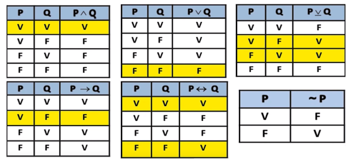
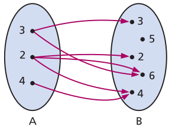

# Matemática Discreta

## Conjuntos

Um conjunto e uma coleção bem definida de elementos distintos. Imagine uma caixa que contém objetos. A caixa representa o conjunto, e os objetos dentro dela são os elementos.

Exemplo: Conjunto A = {1, 3, 5, 7}, que contém os números ímpares de 1 a 7.

**Subconjunto**: Um conjunto que está contido em outro conjunto. É como se a caixa menor estivesse dentro da caixa maior, com todos os seus elementos também presentes na caixa maior.

Exemplo: O conjunto B = {1, 3, 5} é um subconjunto do conjunto A = {1, 3, 5, 7}, pois todos os elementos de B também estão em A.

**União**: A reunião de dois ou mais conjuntos em um único conjunto. É como juntar todas as caixas em um só lugar, reunindo todos os elementos.

Exemplo: A união de A = {1, 3, 5, 7} e B = {1, 3, 5}, escrita como A ∪ B, seria o conjunto {1, 3, 5, 7}, pois contém todos os elementos de A e B, sem repetições.

**Intersecção**: O conjunto formado pelos elementos que pertencem a dois ou mais conjuntos ao mesmo tempo. É como encontrar os elementos que estão em todas as caixas ao mesmo tempo.

Exemplo: A intersecção de A = {1, 3, 5, 7} e B = {1, 3, 5}, escrita como A ∩ B, seria o conjunto {1, 3, 5}, pois contém apenas os elementos que estão em ambos A e B.

**Complemento**: O conjunto formado pelos elementos do universo que não pertencem a um determinado conjunto. É como pegar todos os elementos que não estão dentro da caixa e agrupar em um novo conjunto.

Exemplo: Considerando o universo U como todos os números inteiros positivos, o complemento de A = {1, 3, 5, 7}, escrito como A', seria {2, 4, 6, ...}, pois contém todos os números inteiros positivos que não estão em A (números pares).

**Cardinalidade**: A quantidade de elementos em um conjunto. É como contar quantos objetos estão dentro da caixa.

Exemplo: A cardinalidade do conjunto A = {1, 3, 5, 7}, escrita como card(A), é 4, pois ele possui 4 elementos.

**Conjunto Vazio**: O conjunto que não contém nenhum elemento. É como uma caixa sem nada dentro.

Exemplo: O conjunto vazio, escrito como ∅, é um conjunto especial com zero elementos.

**Conjunto Universal**: O conjunto que contém todos os elementos relevantes para uma determinada situação. É como ter uma caixa gigante que contém todas as caixas menores e seus elementos.

Exemplo: Em um contexto de alunos de uma escola, o conjunto universal poderia ser o conjunto de todos os alunos da escola.

## Lógica Matemática

**Proposições Simples**: Frases que não podem ser decompostas em outras frases lógicas mais simples. Exemplos: "Está chovendo", "O sol é quente".

**Proposições Compostas**: Frases formadas pela combinação de proposições simples usando conectivos lógicos. Exemplos: "Se está chovendo, então o chão está molhado", "Ou eu vou ao cinema ou fico em casa".

**Conectivos Lógicos**: São palavras ou símbolos que conectam proposições simples para formar proposições compostas. Os principais conectivos lógicos são:

- Negação (¬): Nega a verdade da proposição. Exemplo: "¬Está chovendo" significa "Não está chovendo".
- Conjunção (∧): Representa "e". Ambas as proposições devem ser verdadeiras para que a composta seja verdadeira. Exemplo: "Está chovendo ∧ O chão está molhado" significa que ambas as proposições são verdadeiras.
- Disjunção (∨): Representa "ou". Pelo menos uma das proposições deve ser verdadeira para que a composta seja verdadeira. Exemplo: "Está chovendo ∨ Vou ao cinema" significa que pelo menos uma das proposições é verdadeira.
- Disjunção exclusiva (⊕): é verdadeira apenas se uma e somente se uma das proposições for verdadeira, ou seja, se forem mutuamente exclusivas.
- Implicação (→): Representa "se... então...". A primeira proposição (antecedente) implica a segunda (consequente). Exemplo: "Se está chovendo → O chão está molhado" significa que se está chovendo, então o chão está molhado.
- Equivalência (↔): Representa "se e somente se...". Ambas as proposições devem ser verdadeiras ou falsas para que a composta seja verdadeira. Exemplo: "Está chovendo ↔ O chão está molhado" significa que ambas as proposições são verdadeiras ou ambas são falsas.
- Negação forte (¬¬): Nega duas vezes a proposição, resultando na proposição original. Exemplo: "¬¬Está chovendo" significa o mesmo que "Está chovendo".
- Condicional fraco (⊃): Similar à implicação, mas a segunda proposição pode ser falsa sem afetar a verdade da composta. Exemplo: "Se está chovendo ⊃ O chão está molhado" significa que se está chovendo, o chão pode ou não estar molhado.
- Bicondicional fraco (⊊): Similar à equivalência, mas ambas as proposições podem ser falsas sem afetar a verdade da composta. Exemplo: "Está chovendo ⊊ O chão está molhado" significa que se está chovendo, o chão pode ou não estar molhado, e vice-versa.

### Tabela Verdade

Da esquerda para direita: Conjunção, Disjunção, Disjunção Exclusiva, Implicação, Equivalência e Negação.

Ordem de precedência das operações

| Ordem | Operador |
| ----- | -------- |
| 1ª    | `~`      |
| 2 ª   | `^`      |
| 3ª    | `v`,`⊕`  |
| 4ª    | `→`, `↔` |

> Duas preposições são ditas logicamente equivalentes quando possuem os mesmos valores verdadeiros.

## Produto Cartesiano

O produto cartesiano de dois conjuntos A e B, escrito como A x B, é um conjunto que contém todos os pares ordenados (a, b), onde a pertence a A e b pertence a B. Em outras palavras, o produto cartesiano combina elementos de dois conjuntos para formar pares ordenados.

Ex: Seja A = {1, 2, 3} e B = {1, 2}, A x B e B x A serão:

A x B = {(1, 1), (1, 2), (2, 1), (2, 2), (3, 1), (3, 2)}

B x A = {(1, 1), (1, 2), (1, 3), (2, 1), (2, 2), (2, 3)}

## Relação Binária

A relação binária é a relação estabelecida pelos pares.

Ex.: Considerando os conjuntos A = {2, 3, 4} e B = {2, 3, 4, 5, 6}. O produto cartesiano de A x B = {(x, y); x ∈ A e y ∈ B} seria:

A x B = {(2,2), (2,3), (2,4), (2,5), (2,6), (3,2),(3,3),(3,4), (3,5), (3,6), (4,2), (4,3), (4,4), (4,5), (4,6)}

Se estabelecer a seguinte relação para os pares: x é divisor de y, teríamos:

R = {(2,2), (2,4), (2,6), (3,3), (3,6), (4,4)}

Este conjunto é chamado de relação binária de A em B.

A = conjunto de partida da relação R

B = conjunto de chegada ou contradomínio da relação R

É comum a representação da relação por meio de flechas.

### Domínio

Chama-se domínio de R o conjunto D de todos os primeiros elementos dos pares ordenados pertencente a R, ou seja, os elementos vindos do conjunto A.

D ⊂ A, com base no exemplo anterior o domínio seria:

D = {2, 3, 4}

### Imagem

Chama-se imagem de R o conjunto Im de todos os segundos elementos dos pares ordenados pertencente a R, ou seja, ou elementos vindos do conjunto B.

Im ⊂ B, com base no exemplo anterior a imagem seria:

Im = {2, 3, 4, 6}

### Relação inversa

Na relação inversa trocamos as posições dos elementos x e y para y e x.

Sendo assim, a relação inversa de R = {(2,2), (2,4), (2,6), (3,3), (3,6), (4,4)} será:

R⁻¹ = {(2,2), (4,2), (6,2), (3,3), (6,3), (4,4)}

## Funções

Uma função `f` é uma regra (relação) que associa a cada elemento x ∈ A um único elemento y ∈ B. O conjunto A é chamado de domínio da função `f`, e às vezes denotamos por `Df`, é o conjunto B é chamado de contradomínio da função `f`.

Denotação: `f: A -> B`

Para afirmar que um determinado x ∈ A está associado a um certo y ∈ B através da função `f`, denotamos por `f(x) = y`.

### Sequências

Uma sequência finita é uma função `f: Xn -> R` que associa cada elemento de `Xn` a um número real.

Ex.:

Xn = {1, 2, 3...} então f(1) = a1, f(2) = a2, f(3) = a3.

Se existir uma função que associa cada número dos naturais a um número real dizemos que a sequência é infinita.

O termo geral da sequência é an.
