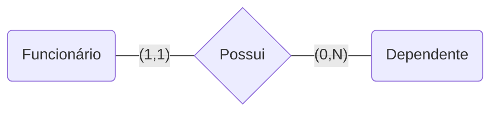

# Modelagem de dados

A modelagem de dados é a primeira etapa de um projeto que envolva banco de dados e tem como seu principal objetivo o desenvolvimento de um modelo que represente as especificações das informações do negócio e de como o software funcionará.

Os modelos de dados demonstram como serão construídas as estruturas de dados, como os dados estarão organizados e quais os relacionamentos que pretendemos estabelecer entre eles.

> Modelagem refere-se à descrição formal da estrutura de um banco de dados, projetando-o para que se possa aproveitar os recursos de um SGDB e que a base de dados seja consistente, permita o reaproveitamento de recursos, exija menos espaços em disco e que seja bem administrado.

Possui três perspectivas:

- Modelagem Conceitual
  - Usada como representação de alto nível e considera exclusivamente o ponto de vista do criador do dado
- Modelagem Lógica
  - Agrega alguns detalhes de implementação
- Modelagem Física
  - Demonstra como os dados são fisicamente

## Banco de dados

Um banco de dados, em essência, é um sistema computadorizado de armazenamento de registros. Nele estarão presentes dados inter-relacionados, representando informações sobre um assunto específico.

O banco de dados armazena os registros em tabelas, essas são constituídas de **linhas** e **colunas**, onde em cada linha haverá um **registro** e as colunas indicarão os **campos** das tabelas.

As **tabelas** também podem ser chamadas de **entidades**, as **colunas** podem ser chamadas de **campos ou atributos** e as **linhas** podem ser chamadas de **registro ou tupla**.

Tabela = Entidade

Coluna = Campos ou Atributos

Linha = Registro ou Tupla

Um banco de dados pode ter uma ou centenas de tabelas, ficando limitado pela ferramenta de software utilizada ou por recursos de hardware.

As tabelas associam-se entre si através de regras de relacionamentos, que consistem em associar um ou vários atributos de uma tabela com um ou vários atributos de outra tabela.

> **Dado**: qualquer elemento do mundo real em sua forma bruta e que não conduz a uma compreensão de determinado fato.
>
> **Informação**: fato útil extraído da organização e processamento de um dado e que permite interpretações e fundamentação de decisões.

## Vantagens do banco de dados

- Redução ou eliminação de redundâncias
- Eliminação de inconsistências
- Compartilhamento dos dados
- Restrições de segurança
- Independência dos dados
- Manutenção da integridade

## Sistema de Gerenciamento de Banco de Dados (SGBD)

É um software que possui recursos capazes de manipular as informações do banco de dados e interagir com o usuário.

Um sistema de banco de dados possui quatro componentes: dados, hardware, software e usuários. O SGBD faz parte do componente software.

A abstração dos dados se da através do sistema que isola o usuário dos detalhes internos do banco de dados e promover a independência dos dados em relação às aplicações.

Para um sistema ser considerado um SGBD ele precisa ter as seguintes características:

- Auto-contenção
- Independência dos dados
- Abstração dos dados
- Visões
- Transações
- Acesso automático

Os bancos de dados funcionam no modelo ACID:

**Atomicidade**: todas as manipulações devem ocorrer por completo, ou tudo da certo, ou nada acontece.

**Consistência**: toda manipulação deve levar o banco de dados de um estado consistente para outro consistente.

**Isolamento**: se eu tenho duas transações feitas ao mesmo tempo elas não podem interferir uma na outra.

**Durabilidade**: todo dado que é alterado, manipulado tem que permanecer dessa forma enquanto eu desejar.

Funções de um SGBD:

- Definição dos dados
- Manipulação dos dados
- Otimização e Execução
- Segurança e integridade dos dados
- Recuperação dos dados e concorrência
- Dicionário de dados

Classificação de um SGBD:

- Número de usuários
  - Monousuário ou Multiusuário
- Localização
  - Centralizado ou Distribuído
- Modelo de dados
  - Hierárquico ou em Árvore
    - Uma informação por campo
    - Relação pai-filho
  - Em rede
    - Resolve problemas do modelo hierárquico (redundância e duplicação)
    - Várias associações por registro
  - Relacionais
    - Estrutura de tabelas
  - Orientados a objetos
    - Informações armazenadas na forma de objetos
  - Objetos-relacionais
    - Combina os benefícios do modelo relacional com a capacidade de modelagem do modelo Orientado a Objetos
    - Usa a linguagem de consulta OR, que é uma extensão da linguagem SQL

Gerações de banco de dados:

- 1ª geração: modelos hierárquicos e em rede
- 2ª geração: surgimento do modelo relacional
- 3ª geração: surgimento do modelo orientado a objetos

Edgar Frank Codd criou treze regras, enumeradas de 0 a 12, que um SGBD relacional precisa seguir.

[12 Regras de Codd](https://pt.wikipedia.org/wiki/12_regras_de_Codd).

## Primary Key

É um campo da tabela que possui valor único e não pode ser nulo.

A chave primária pode ser simples ou composta.

Simples: ex: matrícula

Composta: ex: agência e conta

## Foreign Key

É um campo da tabela que se refere a chave primária de outra tabela.

## Integridade referencial

A integridade referencial é um conceito que garante que todos os relacionamentos entre tabelas serão respeitados. Inclusive, impede a exclusão de um campo se ele estiver relacionado ao campo de outra tabela de forma dependente.

Por exemplo, se um campo na tabela A for chave primária e estiver relacionado a outra tabela, sendo nessa chave estrangeira, não será possível excluir esse dado na tabela A, uma vez que a segunda tabela depende dele.

- Os campos relacionados devem ter o mesmo tipo de dado
- Ambas as tabelas pertencem à mesma base de dados

## Consistência de Dados

Refere-se a fato de que sempre que um dado vier de locais diferentes eles precisam ter o mesmo valor.

## Cardinalidade

É uma forma de restrição de integridade que quantifica a quantidade mínima e máxima de relacionamentos entre entidades.

Lê-se: Um funcionário pode ter no mínimo zero (0) ou no máximo muitos (N) dependentes, e um dependente pode ter no mínimo um (1) e no máximo um (1) funcionário associado.

Tipos de relacionamentos:

- um-para-um (1:1)
  - Uma ocorrência da entidade A está associada a no máximo uma ocorrência da entidade B, e uma ocorrência de B está associada a no máximo uma ocorrência de A.
- um-para-muitos (1:n)
  - Uma ocorrência da entidade A está associada a várias ocorrências da entidade B, porém uma ocorrência de B deve estar associada a no máximo uma ocorrência em A.
- muitos-para-muitos (n:n)
  - Uma ocorrência na entidade A está associada a qualquer número de ocorrências da entidade B, e uma ocorrência em B está associada a qualquer número de ocorrência na entidade A.
  - Todo relacionamento n:n deve ser desmembrado em dois relacionamento 1:n, pois banco de dados relacional não permite esse tipo de cardinalidade. Para isso deve ser criado uma Entidade em comum.

## Tipos de atributos

**Simples**: atributos atômicos, indivisíveis.

**Compostos**: atributos que podem ser divididos em partes menores, ou subpartes, com significados independentes. Ex: endereço pode ser dividido em rua, cidade, etc.

**Monovalorados**: atributos que possuem apenas um valor para uma entidade em particular. Ex: idade é um atributo monovalorado para uma entidade pessoa.

**Multivalorado**: atributos que possuem um ou mais valores. Ex: idioma pode conter vários valores.

**Derivado**: atributos que podem ter uma relação entre si. Ex: o valor da idade de uma pessoa é determinado através da sua data de nascimento.

## Normalização

A normalização dos dados é uma série de dados que permite armazenar os dados de forma consistente e eficiente, de forma a reduzir a redundância e a inconsistência.

Edgar Frank Codd definiu três das regras usadas para normalização de dados, mas existem outras que geralmente são aceitas também.

### Primeira Forma Normal (1FN)

Os atributos precisam ser atômicos,simples e indivisíveis.

- Passos:
  - 1ª dividir a tabela maior em tabelas menores
  - 2ª identificar as chaves primárias de cada nova tabela
- A 1FN não permite atributos multivalorados, atributos compostos e suas combinações.

### Segunda Forma Normal (2FN)

Deve estar na 1FN e todos os atributos não-chave devem depender plenamente da chave primária.

- Toda tabela 1FN que possui uma chave primária com um único atributo, já se encontra na 2FN
- Tabelas que possuem chave primária composta e pelo menos um atributo não-chave com dependência funcional devem ser passadas para 2FN
- Passos:
  - Os atributos que dependem apenas de uma parte da chave primária devem ser movidos para outra tabela.
  - 1ª identificar os atributos que dependem apenas de uma parte da chave primária composta
  - 2ª criar uma nova tabela com o atributo dependente e a chave primária do qual ele depende

#### Dependência Funcional

A **dependência funcional** (DF) é uma associação que se estabelece entre dois ou mais atributos em uma relação.

A notação da DF é: **A -> B** (a seta parte de quem identifica), que significa que em uma relação R, B é funcionalmente dependente de A se cada um dos valores de A tem associado a si um e um só valor de B.

Se conhecermos o valor de A então podemos encontrar o valor de B associado a ele, pois B depende de A.

> Todos os atributos que não fazem parte da chave primária de uma relação são funcionalmente dependente dela.

A **dependência funcional completa (plena)** ocorre quando um atributo depende de toda a chave primária.

A **dependência funcional parcial (não plena)** ocorre quando um atributo depende de parte da chave primária composta.

### Terceira Forma Normal (3FN)

Deve estar na 2FN e nenhum atributo não-chave é transitivamente dependente da chave primária.

- Toda tabela na 2FN que possui menos de dois atributos não-chave encontra-se na 3FN
- Tabelas com dois ou mais atributos não-chave devem ser passadas para a 3FN
- Passos:
  - 1ª criar uma nova tabela com a chave primária da tabela em questão
  - 2ª se o atributo não-chave depender apenas da chave primária, adicionar ele a nova tabela
  - 3ª se o atributo não-chave tiver dependência transitiva, ou seja, depender de outro atributo não-chave, copiar o atributo dependente para uma nova tabela onde a chave primária dessa tabela será o atributo do qual há uma dependência

#### Dependência Transitiva

A **dependência transitiva ou indireta** ocorre quando um atributo, além de depender da chave primária, depende de outro atributo ou conjunto de atributos da tabela.

Ocorre quando Y depende de X, e Z depende de Y, logo, Z também depende de X. A sua notação é: **X -> Y -> Z**.
