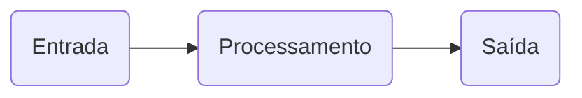
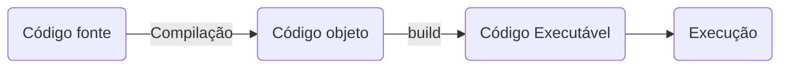
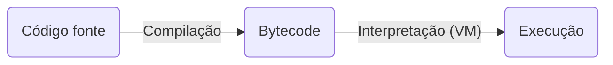

## Programação Estruturada

A programação estruturada orienta os programadores para a criação de estruturas simples (módulos) em seus programas, usando as sub-rotinas e funções.

### Lógica de Programação

Refere-se à capacidade de desenvolver algoritmos e estruturar instruções de forma lógica e sequencial para resolver problemas computacionais.

A Lógica de Programação é aplicada em estrutura de dados, programação orientada a objetos, banco de dados e análise e design de sistemas.

### Algoritmo

> É uma sequência finita de passos lógicos bem definidos e não ambígua que quando executados na ordem correta conseguem realizar uma determinada ação.

### Os 6 métodos para construção de um algoritmo

1. Compreender completamente o problema a ser resolvido, destacando os pontos mais importantes e os objetos que o compõe;
2. Definir os dados de entrada, ou seja, quais dados serão fornecidos e quais objetos fazem parte desse cenário-problema;
3. Definir o processamento, ou seja, quais cálculos serão efetuados e quais as restrições para esses cálculos. O processamento é responsável pela transformação dos dados de entrada em dados de saída;
4. Definir os dados de saída, ou seja, quais dados serão gerados depois do processamento
5. Construir o algoritmo utilizando **descrição narrativa**, **fluxograma** ou **pseudocódigo**;
6. Testar o algoritmo realizando simulações.

### Finalidade de um computador

> Receber dados por um dispositivo de entrada, processar esses dados e gerar uma resposta que será expressa em um dispositivo de saída.

> Ele só consegue executar essas ações através de programas. Mas só executa algoritmos computacionais[^1], como o processamento de dados e cálculos.

[^1]: Descrição das ações a serem executadas por um computador.

### Software

> Um ou mais programas interligados que realizam o processamento de dados. Esses programas devem ser escritos em uma linguagem de programação.

### Etapas de desenvolvimento de um programa

- Análise
- Algoritmo
- Codificação

### Programa

> É a codificação de um algoritmo em uma linguagem de programação.

### Linguagem de programação

> É um conjunto de regras sintáticas e semânticas para se escrever programas que permitem a comunicação entre um ser humano e um computador.

A sintaxe se concentra na estrutura e na organização do código, enquanto a semântica lida com o significado e o comportamento das instruções.

### IDE (Ambiente Integrado de Desenvolvimento)

> É um software utilizado para construir, editar e testar programas.
> Ex: Code Blocks (C/C++), Eclipse, NetBeans (Java), Visual Studio (C#)

### Funcionalidades de uma IDE

1. Edição de código fonte (autocompletar, identação, destaque de palavras)
2. Depuração e testes
3. Construção de produto final (build)
4. Sugestão de modelos (templates)

### Código fonte

> É o algoritmo escritor pelo programador em uma linguagem de programação.

### Tipos de código

- Código fonte
- Código objeto
- Bytecode

### Gerador de código ou máquina virtual

> Software que permite que o programa seja executado.

### Modelos de execução de código fonte

- Compilação
- Interpretação
- Abordagem Híbrida

### Compilação

> A compilação usa um software para transformar o código fonte em código objeto. Durante o processo de compilação é feita a verificação léxica e sintática do código fonte.
> Linguagens compiladas: C, C++

### Interpretação

> Na interpretação o código fonte é transformado em executável sem passar pelo compilador. O interpretador fará a verificação léxica, sintática e geração de código sob demanda.
> Linguagens interpretadas: PHP, Javascript, Python

### Abordagem híbrida

> Na abordagem híbrida o código fonte é compilado e depois interpretado pela máquina virtual.
> Linguagens híbridas: Java, C#

### Variável

> É um espaço em memória que armazena dados durante a execução do programa.

### Estrutura Sequencial

> São algoritmos que executam em sequência, de cima para baixo.

### Estrutura Condicional Simples

> Uma estrutura de controle simples definir que um bloco de instruções será executado se uma determinada condição for satisfeita. Essa condição é representada por expressões lógicas.

### Estrutura Condicional Composta

> Uma estrutura condicional composta define que um bloco de instruções será executado se determinada condição for satisfeita, mas caso essa condição seja falsa, é executado um outro bloco de instruções diferente.

### Estrutura Repetitiva

#### Enquanto

> Estrutura de controle que repete um bloco de comandos enquanto uma condição for verdadeira. Usada quando não se sabe a quantidade de repetições que será realizada.

#### Para

> Estrutura de controle que repete um bloco de comandos para um certo intervalo de valores. Usada quando sabe previamente o número de repetições que será realizada.

#### Repita-Até

> Estrutura de controle onde o bloco de comandos será executado pelo menos uma vez, pois a condição é verificada no final.
