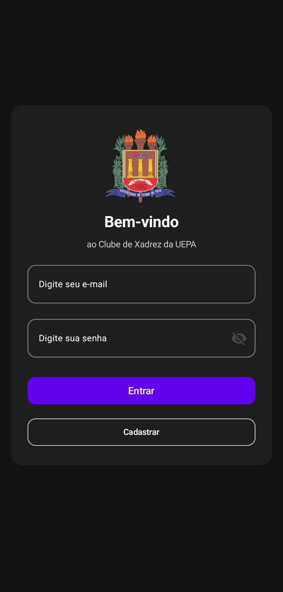
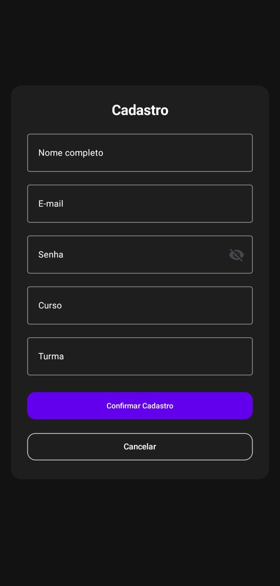
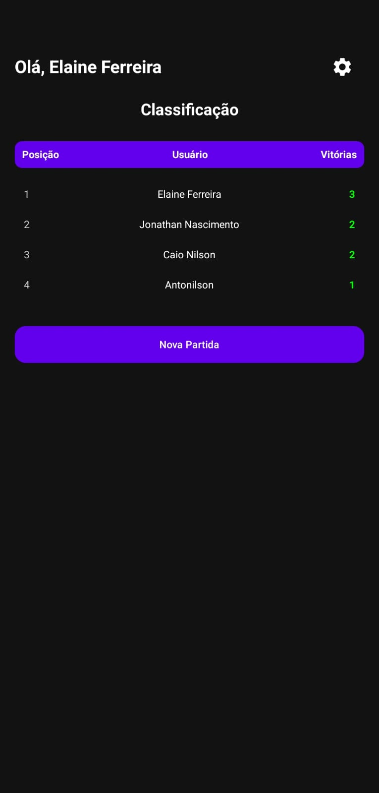
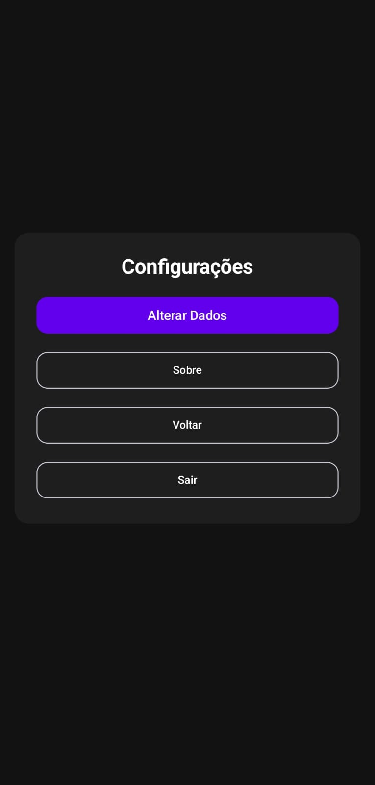
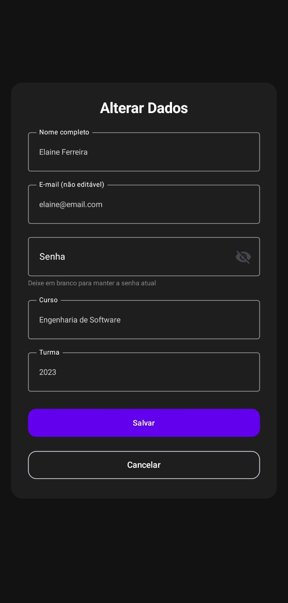
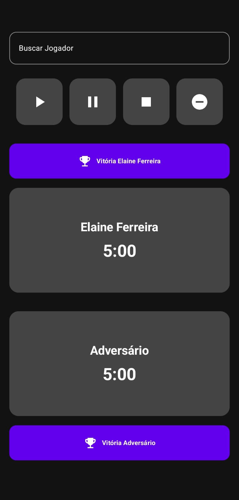
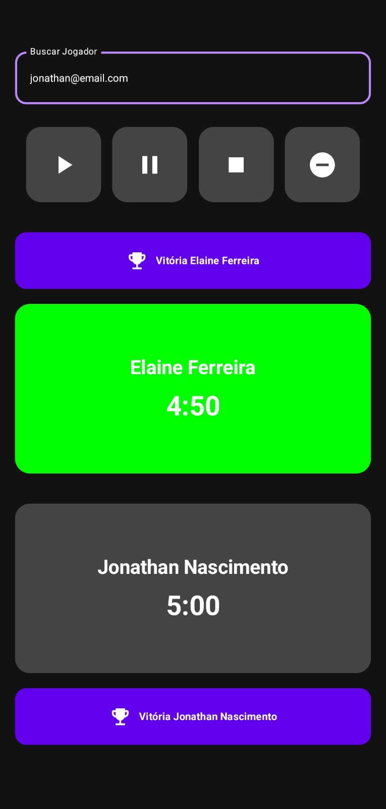
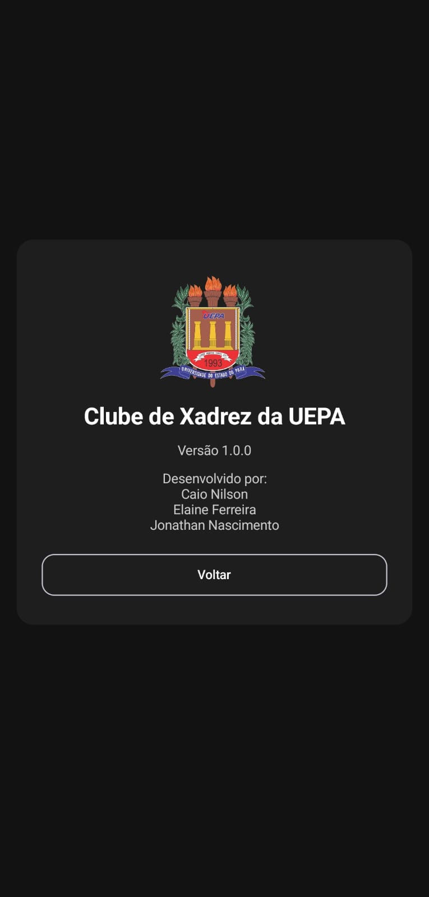

# Programação Mobile

Durante a disciplina de programação mobile foi ensinado a linguagem Kotlin.

Como projeto final, foi desenvolvido um aplicativo para um Clube de Xadrez.

[App Clube de Xadrez](./Projects/app/src/main/java/com/example/xadrez/MainActivity.kt)

