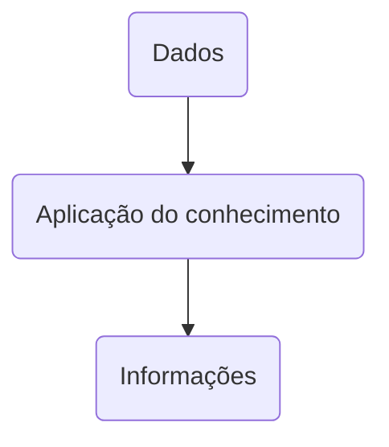

# Fundamentos de Sistemas de Informação

O sistema de informação (SI) é um conjunto de componentes inter‑relacionados que coleta, manipula, armazena e dissemina dados e informações e fornece mecanismo de realimentação (feedback) para atingir um objetivo, como por exemplo, ajudar as organizações a alcançar suas metas, como o aumento nos lucros ou a melhoria de serviços ao consumidor.

## Dados, informação e conhecimento

**Dados**: são fatos brutos que representam o mundo real.

**Informação**: são os fatos organizados e processados de maneira que tenham valor adicional além do valor dos fatos individuais.

**Conhecimento**: é a consciência e compreensão de um conjunto de informações e maneiras como essas informações podem ser úteis para apoiar uma tarefa específica ou para chegar a uma decisão.

> **Processo**: conjunto de tarefas organizadas de forma lógica para obter um resultado definido.

Um **sistema de gestão do conhecimento** (SGC) é um conjunto organizado de pessoas, procedimentos, software, bancos de dados e dispositivos utilizados para criar, armazenar, compartilhar e usar a experiência e o conhecimento da organização.

Processo de transformar dados em informação

## Características de informações valiosas

- Informação acessível
- Precisa
- Completa
- Econômica
- Flexível
- Relevante
- Confiável
- Segura
- Simples
- Atualizada
- Verificável

Dependendo do tipo de dados, alguns desses atributos tornam-se mais valiosos do que outros.

## Sistema

É um conjunto de elementos que interagem para realizar objetivos. Eles possuem entradas, mecanismos de processamento, saídas e realimentação.

### Desempenho do sistema e padrões

O desempenho do sistema pode ser medido de várias maneiras.

**Eficiência**: é uma medida do que é produzido divido pelo que é consumido e pode variar de 0 a 100%.

**Eficácia**: é uma medida do grau em que um sistema alcança suas metas e pode ser calculada dividindo-se as metas efetivamente alcançadas pelo total de metas estabelecidas.

Para avaliar o desempenho de um sistema podem ser usados **padrões de desempenho**, que é um objetivo específico do sistema. Após o padrão ser estabelecido, o desempenho do sistema é medido e comparado com o padrão.

## Componentes de um sistema de informação

**Entrada**: atividade de captar e reunir os dados brutos.

**Processamento**: converter ou transformar dados em saídas úteis. Após o processamento normalmente os resultados são armazenados.

**Saída**: envolve a produção de informações úteis normalmente na forma de documentos e relatórios. Em alguns casos, a saída de um sistema pode se tornar a entrada de outro sistema.

**Feedback**: é a informação originada no sistema, utilizada para realizar mudanças na entrada ou nas atividades de processamento.

