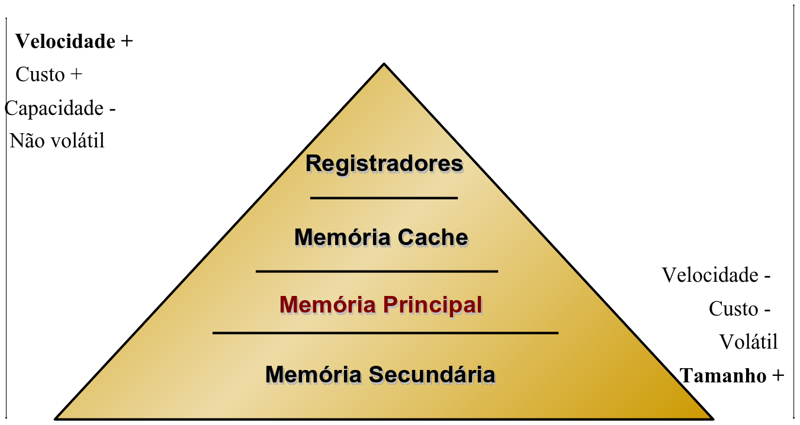

# Fundamentos de Sistemas Operacionais

O sistema operacional tem o objetivo de automatizar e preparar a execução de programas, além de otimizar os recursos do hardware e proporcionar uma interface adequada para os usuários utilizarem os recursos do sistema.

> "Um programa que atua como intermediário entre o usuário e o hardware de um computador" (Silberschatz)

A máquina analítica de Charles Babbage (1792-1871) é considerada o primeiro computador.

## Gerações dos Computadores

### Primeira Geração

- 1940 a 1955
- Sem sistemas operacionais
- Usavam válvulas
- Programação realizada em painéis
- Mark I (1943 - 1944) - fazia multiplicações simples em 6 segundos, mas pesava 5 toneladas e ocupava 100m²
- ENIAC (1946): primeiro computador de propósito geral, pesava 30 toneladas e ocupava 180m²
- EDVAC: primeira proposta de máquina com programa armazenado (instituição da [arquitetura de Von Neumann](https://www.wikiwand.com/pt/Arquitetura_de_von_Neumann))
- UNIVAC: primeiro computador comercial de sucesso

### Segunda Geração

- 1955 a 1965
- Criação de transistor e das memórias magnéticas
- Criação das primeiras linguagens de programação (Assembly e Fortran)
- Surgimento dos primeiros sistemas operacionais
  - Fortran Monitor System
  - IBSYS
- Processamento em Batch (lote)
- Conjunto de rotinas para operações I/O

### Terceira Geração

- 1966 a 1980
- Surgimento dos Circuitos Integrados
- Diminuição dos custos dos sistemas computacionais
- Multiprogramação com compartilhamento de memória
- Interações on-line através de vídeos e teclado
- Criação do Unix

### Quarta Geração

- 1981 a 1990
- Surgimento dos PCs de 16bits
- Criação do DOS
- Sistemas passam a ser multiusuários, multitarefas e multiprocessamento
- Sistemas operacionais de Rede (Novell)

### Quinta Geração

- 1991 a 20??
- Inteligências Artificiais
- SO Distribuídos
- Programação concorrente
- Multimídia
- Internet das Coisas (IoT)
- Bancos de Dados Distribuídos
- Computação em nuvem, etc

## Organização de um SO

- Núcleo (kernel)
  - Responsável pela gerência do processador, tratamento de interrupções, comunicação e sincronização entre processos
- Gerente de memória
  - Responsável pelo controle e alocação de memória aos processos ativos
- Sistema de Arquivos
  - Responsável pelo acesos e integridade dos dados residentes na memória secundária

## Estrutura de um sistema computacional

- Hardware: provê os recursos básicos de computação, CPU, memória, dispositivos de E/S
- Sistema Operacional: controla e coordena o uso do hardware entre vários aplicativos e usuários
- Programas aplicativos: definem as formas em que os recursos computacionais são usados para resolver problemas computacionais dos usuários
- Usuários: pessoas, máquinas, outros computadores

Algumas autores fazem a separação em 3 partes apenas: Hardware, Software e Peopleware.

## Classificação de S.O

- Monotarefa
  - Somente um programa por vez é carregado na memória
- Multitarefa
  - Vários programs podem ser carregados simultaneamente na memória (tabela de processos)
- Monolíticos
  - Linux, Unix, Windows, MS-DOS e Mac OS
  - Um único arquivo objeto
  - Toda rotina fica visível às demais
  - Chamada de núcleo (chamada de supervisor) para trocar o modo usuário/núcleo
- Microkernel
  - Minix e Symbian
  - Funcionalidades são quase todas executadas fora do núcleo
  - Núcleo mínimo, usa o mínimo de espaço do sistema
- Em Camada
  - Operador, Programas de usuário, Gerenciamento de E/S, Comunicação operador-processo, Gerenciamento de memória e tambor, Alocação do processador e multiprogramação

## Comunicação entre os modos de acesso

A dois modos de acesso ao sistema:

- Modo usuário: shell
- Modo kernel: administrador

Chamada de sistema são instruções estendidas e funcionam como uma interface entre o S.O e os programas de usuário.

O S.O examina os parâmetros para determinar qual das chamadas de sistema deve ser executada, em seguida, o S.O verifica em uma tabela indexada, o endereço do procedimento que executa a chamada ao sistema, após a conclusão da chamada de sistema, o controle retorna ao programa do usuário.

Qualquer ação que requer acesso privilegiado realiza uma chamada de sistema que altera o modo do usuário para o modo kernel.

Traps são instruções de software e é a forma como é realiza as chamadas de sistema.

## Interfaces de chamadas de sistema

As API são interfaces que encapsula o acesso direto às chamadas ao Sistema.

São escritas em linguagens de alto nível com C, C++, etc.

As mais utilizadas são:

- Win32: API para Windows
- POSIX: API para Unix
- JVM: API para Java

## Interrupções e Traps

- Interrupções
  - Evento externo ao processador
  - Gerado por dispositivos que precisam da atenção do SO
  - Pode estar relacionado ao processo que está rodando
- Traps
  - Evento inesperado vindo de dentro do processador
  - Causados pelo processo concorrente no processador

## BIOS

Programa armazenado na ROM que inicializa todos os aspectos do sistema, dos registradores da CPU, dos controladores de dispositivos e conteúdos da memória.

## Interações com SO

Pode ser feito de duas formas

- CLI (Command-line Interface): shell interpretador de comandos
- GUI (Graphical User Interface): interface gráfica

## Processo

É a instância de um programa em execução, incluindo valores dos registradores e variáveis. Cada processo possui uma CPU virtual.

Possui três estados: executando, bloqueado e pronto.

- Executando: realmente usando a CPU naquele momento
- Bloqueado: incapaz de executar enquanto um evento externo não ocorrer
- Pronto: em memória, pronto para executar (ou para continuar sua execução), apenas aguardando a disponibilidade do processador

Cada processo possui uma prioridade e os processos com maior prioridade são executados primeiro.

_Starvation_ ocorre quando um processo com prioridade baixa nunca é executado.

## Thread

É uma forma de um processo dividir a si mesmo em duas ou mais tarefas que podem ser executadas concorrencialmente.

As threads compartilham um mesmo espaço de endereço.

## Escalonamento de processos

O escalonador de processos (scheduler) escolhe qual será o próximo processo a ser executado.

Quando um processo deixa a CPU seu estado é salvo antes de carregar o estado de outro processo, esse processo é chamado de troca de contexto (BCP).

A troca do contexto é feita pelo despachador (dispatcher) após o escalonador ter definido qual será o processo que fará uso do processador.

**Preemptivo**: quando o processo pode deixar, por algum motivo, a CPU. Isso ocasiona uma interrupção forçada de um processo para que outro possar usar a CPU.

**Não preemptivo**: não permite que o processo em execução perca a CPU. Dessa forma, é preciso que a tarefa termine sua execução para que então ocorra a liberação da CPU.

### Algoritmos de Escalonamento

- First-Come First-Served (FCFS) - Não Preemptivo
- Shortest Job First (SJF) Idealmente - Não Preemptivo
- Shortest Remaining Time Next (SRTN) - Preemptivo
- Round-Robin (RR) - Preemptivo
- Prioridade - Pode ser Preemptivo ou Não Preemptivo
- Múltiplas Filas - Pode ser Preemptivo ou Não Preemptivo
- Shortest Process Next (SPN) - Idealmente Não Preemptivo
- Lottery - Preemptivo

## Comunicação entre processos

Comunicação realizada através de uma área de armazenamento em comum, essa área pode estar na memória principal (variáveis em comum) ou podem ser um arquivo compartilhado.

É possível impedir que mais de um processo leia e escreva em uma variável compartilhada ao mesmo tempo, isso é chamado de exclusão mútua.

## Deadlock

É um impasse de forma circular entre processos que detêm um recurso e necessita de outro já alocado e não possui previsão de ser liberado, fazendo com que o processo entre em starvation.

Ocorre quando as seguinte características estão presentes em um processo:

- Exclusão mútua
- Manter e esperar
- Não preempção
- Espera circular

## Gerenciamento de Memória

Geralmente fica no kernel do S.O e tem como objetivo monitorar as partes da memória que estão em uso e as que não estão, alocando e liberando memória para os processos.

Memory leak: gerência equivocada de alocações de memória (não é liberada quando não é mais necessária)

Thrashing: excessiva transferência de blocos entre a memória principal e a secundária.

Page fault: quando um programa acessa uma página mapeada no espaço de memória virtual que não foi carregada na memória física.

Hierarquia de Memória

